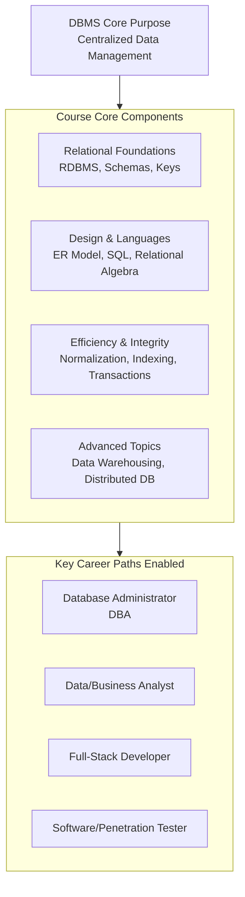

### **Database Management Systems (DBMS)** 
[ Playlist](https://www.youtube.com/playlist?list=PLBlnK6fEyqRiyryTrbKHX1Sh9luYI0dhX) 

| No. | Video Title | Duration |
|:---|:---|:---|
| 1 | Introduction to Database Management Systems (DBMS) | 9:38 |
| 2 | DBMS - Definition | 9:01 |
| 3 | Applications of DBMS | 7:18 |
| 4 | File System vs. Database Management System | 23:13 |
| 5 | Three Tier Architecture | 11:00 |
| 6 | View of Data | 10:23 |
| 7 | Instances and Schemas in DBMS | 9:33 |
| 8 | Database Users | 8:24 |
| 9 | Database Administrator (DBA) | 7:29 |
| 10 | Introduction to Data Models | 16:24 |
| 11 | Database System Architecture - Part 1 | 14:33 |
| 12 | Database System Architecture - Part 2 | 15:46 |
| 13 | History of DBMS | 6:52 |
| 14 | Database Languages and Software | 12:14 |
| 15 | Introduction to DBMS - Solved Questions | 9:20 |
| 16 | Introduction to Relational Databases | 12:08 |
| 17 | Codd’s 12 Rules (13 Rules) | 15:51 |
| 18 | Database Schema | 8:39 |
| 19 | Keys in RDBMS | 22:49 |
| 20 | Keys in RDBMS (Solved Questions) | 10:20 |
| 21 | Schema Diagrams | 12:54 |
| 22 | Relational Query Languages | 7:48 |
| 23 | Basics of Relational Algebra | 7:53 |
| 24 | Relational Algebra (Select Operation) | 16:07 |
| 25 | Relational Algebra (Project Operation) | 8:32 |
| 26 | Relational Algebra (Union Operation) | 20:15 |
| 27 | Relational Algebra (Set Difference Operation) | 15:24 |
| 28 | Relational Algebra (Cartesian Product Operation) | 24:41 |
| 29 | Relational Algebra (Rename Operation) | 9:37 |
| 30 | Relational Algebra (Set Intersection Operation) | 20:35 |
| 31 | Relational Algebra (Assignment Operation) | 8:03 |
| 32 | NULL Values in RDBMS | 7:17 |
| 33 | Relational Algebra (Natural Join Operation) | 26:11 |
| 34 | Relational Algebra (Division Operation) | 8:42 |
| 35 | Relational Algebra (Outer Join Operation) | 10:52 |
| 36 | Relational Algebra (Solved Problem 1) | 9:04 |
| 37 | Relational Algebra (Solved Problem 2) | 6:38 |
| 38 | Relational Algebra (Solved Problem 3) | 5:36 |
| 39 | Relational Algebra (Solved Problem 4) | 19:49 |
| 40 | Relational Algebra (Solved Problem 5) | 10:20 |
| 41 | Tuple Relational Calculus (Formal Definition) | 12:18 |
| 42 | Tuple Relational Calculus (Example Queries) | 17:24 |
| 43 | Domain Relational Calculus (Formal Definition) | 10:10 |
| 44 | Domain Relational Calculus (Example Queries) | 16:15 |
| 45 | Relational Algebra (Rapid Fire Quiz) | 9:13 |
| 46 | Database Design | 10:49 |
| 47 | Introduction to E-R Model (Part 1) | 20:12 |
| 48 | Introduction to E-R Model (Part 2) | 10:27 |
| 49 | Types of Attribute in DBMS | 10:32 |
| 50 | Mapping Cardinalities | 10:32 |
| 51 | Entity-Relationship (ER) Diagram | 17:17 |
| 52 | Mapping Cardinality in ER Diagram | 7:39 |
| 53 | Participation Constraints in DBMS | 9:31 |
| 54 | ER Diagram for University Database | 21:30 |
| 55 | ER Diagram for Banking Enterprise | 15:08 |
| 56 | ER Diagram for Hospital Management System | 16:21 |
| 57 | Extended ER Features | 25:26 |
| 58 | ER Model (Solved Problem 1) | 7:49 |
| 59 | ER Model (Solved Problem 2) | 8:13 |
| 60 | ER Model (Solved Problem 3) | 7:18 |
| 61 | ER Model (Rapid Fire Quiz) | 10:00 |
| 62 | Introduction to Structured Query Language (SQL) | 8:41 |
| 63 | Data Definition Language (DDL) | 6:00 |
| 64 | DDL Commands - CREATE | 13:56 |
| 65 | Constraints in SQL | 7:24 |
| 66 | Constraints in SQL (Example Queries) | 9:50 |
| 67 | Primary Key and Foreign Key Constraints in SQL | 12:40 |
| 68 | DDL Commands - ALTER | 11:15 |
| 69 | DDL Commands - TRUNCATE, DROP, and RENAME | 6:05 |
| 70 | DML Commands - INSERT and UPDATE | 11:25 |
| 71 | DML Commands - DELETE and SELECT | 10:55 |
| 72 | Data Control Language (DCL) | 10:31 |
| 73 | Transaction Control Language (TCL) | 8:44 |
| 74 | Aggregate Functions in SQL | 11:41 |
| 75 | GROUP BY and HAVING Clause in SQL | 7:57 |
| 76 | ORDER BY in SQL | 5:37 |
| 77 | LIKE in SQL | 8:55 |
| 78 | IN in SQL | 6:13 |
| 79 | BETWEEN in SQL | 6:26 |
| 80 | Alias (AS) in SQL | 10:06 |
| 81 | TOP, LIMIT, FETCH FIRST, and ROWNUM in SQL | 7:03 |
| 82 | NULL Functions in SQL | 15:03 |
| 83 | ANY and ALL Operators in SQL | 11:07 |
| 84 | CASE Expression in SQL | 9:42 |
| 85 | Comments in SQL | 11:36 |
| 86 | Joins in SQL | 24:08 |
| 87 | SQL - Solved Problem 1 | 8:55 |
| 88 | SQL - Solved Problem 2 | 7:29 |
| 89 | SQL - Solved Problem 3 | 6:22 |
| 90 | SQL (Rapid Fire Quiz) | 22:25 |

| 1 | Introduction to Database Management Systems (DBMS) | 9:38 |

### 📊 Core Purpose of a DBMS

The core purpose of a DBMS is to serve as a centralized, organized system for storing, managing, and using critical data, replacing inefficient manual filing systems. This is vital because **data is a valuable, long-lasting asset** for any organization.

**Example**: A pencil manufacturing company stores details (length, color, manufacturing date, price, barcode) for every item. If a customer complains, the company can scan the barcode to find the exact batch and manufacturing date to determine if it's an isolated fault or a problem affecting thousands of pencils. This **enables accountability and transparency** for continuous improvement and regulatory compliance (like filing taxes).

### 🧑‍🎓 Target Audience & Scope

The course is designed for:
*   **Undergraduate (UG) students** and competitive exam aspirants (GATE, ISRO).
*   **Career paths** requiring database knowledge, including:
    *   **Database Administrator (DBA)**: The person with complete control and responsibility over the database.
    *   **Data Analyst / Business Analyst**: Professionals who interpret data to guide business decisions.
    *   **Full-Stack Developer**: Developers who need both front-end (user interface) and back-end (database) skills.
    *   **Software/Penetration Tester**: Testers who need to understand databases to assess application security.

### 📚 Course Syllabus & Key Topics

The full course covers 14 chapters, giving you a structured learning path from fundamentals to advanced concepts. Here are some of the core topics:

| Chapter | Focus Area | Key Concepts Covered |
| :--- | :--- | :--- |
| **1 & 2** | **Relational Database Foundations** | Introduction to RDBMS, Codd's Rules, Keys, Schemas. |
| **3** | **Database Design** | Entity-Relationship (ER) Model, ER Diagrams. |
| **4 & 5** | **Structured Query Language (SQL)** | Basics (CREATE, SELECT) & Advanced features (Procedures, Triggers). |
| **6** | **Formal Query Languages** | Relational Algebra, Tuple & Domain Relational Calculus. |
| **7** | **Database Normalization** | Various Normal Forms (1NF, 2NF, 3NF, BCNF), Functional Dependencies. |
| **8 & 9** | **Storage & Performance** | File Structures, **Indexing**, Hashing. |
| **10** | **Query Efficiency** | **Query Processing** and **Optimization**. |
| **11** | **Data Integrity** | **Transactions**, **Concurrency Control**. |
| **12-14** | **Advanced Architectures** | Distributed Databases, Data Warehousing, Data Mining. |

Here is a visual summary of the DBMS course structure and its key career paths:

### 💡 Key Takeaways & How to Use This Information

The introduction establishes that a DBMS is far more than just digital storage. It is a **system for ensuring data is accurate, accessible, secure, and useful**. From the pencil company example to the listed career paths, the value lies in turning raw data into reliable information for decision-making.

To make the most of your learning:
*   **Relate Concepts to Real Scenarios**: As you learn about **keys**, think of them as unique barcodes. When studying **transactions**, imagine a banking system ensuring money is correctly deducted from one account and added to another.
*   **Follow the Structure**: The 14-chapter syllabus provides a logical progression. Mastering early concepts (like the ER Model and SQL) is crucial for understanding later, more complex topics (like normalization and optimization).

| 2 | DBMS - Definition | 9:01 |

Based on the transcript from the video "DBMS - Definition," here is an extraction and explanation of the key concepts, complete with examples.

### 📚 Key Concepts from the Video

| Concept | Explanation | Real-World Example |
| :--- | :--- | :--- |
| **Core DBMS Definition** | A **Database Management System (DBMS)** is a **collection of interrelated data** and a **set of programs** to access and manage that data efficiently. | An **ATM system** uses a DBMS. The *data* (customer accounts, balances) are stored centrally and interrelated. The *programs* fetch this data when you insert your card, allowing you to view your balance and withdraw money. |
| **Interrelated Data** | Data in a database is not stored randomly; it is **logically connected**. In a table (rows & columns), all data in a single row pertains to one entity, creating relationships. | In a **product table**, one row contains the *Model*, *Color*, and *Manufacturing Date* for a specific pen. These data points are interrelated because they all describe that single pen. |
| **Primary Goals of a DBMS** | The main objectives are to provide a **convenient** and **efficient** environment for **storing data** and **retrieving data**. | A **library database** allows librarians to easily *store* details of new books (convenient storage) and lets you quickly *find* a book by its title or author (efficient retrieval). |
| **Managing Large Volumes of Information** | A DBMS is designed to handle **large, complex, and diverse bodies of information** from organizations, recording all transactions for transparency. | An **e-commerce platform** uses a DBMS to manage millions of products, customer profiles, orders, and payment histories—a massive volume of interconnected data. |
| **Data Manipulation** | A DBMS provides mechanisms to **manipulate data**, including inserting, updating, deleting, and querying, to keep information accurate. | When you **change your phone number** in a banking app, you are using the DBMS's data manipulation functions to *update* your customer record. |
| **Data Security & Safety** | A fundamental role of a DBMS is to **protect** the stored data from unauthorized access, corruption, or loss. | A **hospital's patient database** uses access controls (usernames/passwords) to ensure only authorized doctors and nurses can view or modify sensitive medical records. |
| **Data vs. Information** | **Data** are **raw, unprocessed facts** (numbers, text). **Information** is **data that has been processed, organized, or interpreted** to have meaning and context. | **Data:** `"Raghav"`, `25`, `"Nagpur"`. **Information:** "Raghav, who resides in Nagpur, is 25 years old." The raw facts are given context and meaning. |
| **Metadata** | This is **"data about data."** It describes the characteristics, origin, usage, or history of other data. | For a **digital photo file**, the image itself is data. Its **metadata** includes the file size, creation date, camera model, and GPS location where it was taken. |

---

### 📝 Summary: The Essence of a DBMS

The video builds a clear understanding of a DBMS by starting with a technical definition and expanding it with practical context:

1.  **It's More Than Storage**: A DBMS is not just a digital filing cabinet. It is an **active software system** that both *holds* interrelated data and provides the *tools (programs)* to work with that data.
2.  **It Solves Practical Problems**: The examples (ATM, product table) illustrate that the core value of a DBMS lies in managing **real-world complexity**—connecting data points, handling large scales, and enabling secure, efficient access.
3.  **It Creates Knowledge**: By distinguishing between **data** (raw material) and **information** (processed knowledge), the video highlights the DBMS's role in transforming simple facts into useful, actionable insights for organizations and users.

In essence, a DBMS is the foundational technology that allows modern organizations to move from merely collecting data to effectively **managing information**.

| 3 | Applications of DBMS | 7:18 |

### **Core Concept: The Purpose of a DBMS**
A DBMS is used to **store, manage, and retrieve** vast amounts of structured data efficiently and reliably for organizations of all types. It replaces older, less efficient systems like file-based storage by providing organization, security, and easy access to data.

### **Key Applications of DBMS (with Examples)**

The transcript highlights that DBMS is the backbone of modern data-driven operations across almost every sector.

Here is a summary of the primary application areas discussed:

| Application Area | Key Data Managed | Real-World Examples |
| :--- | :--- | :--- |
| **1. Sales & Retail** | Customer details, product inventory, purchase history, supplier info. | Grocery stores, pharmacies, supermarkets (e.g., tracking what items sell best). |
| **2. Finance** | Stock/bond portfolios, online trading records, sales data, market info. | Investment banks, stock trading platforms (e.g., maintaining a user's stock portfolio). |
| **3. Banking** | Customer accounts, loans, transactions, credit cards, monthly statements. | Any commercial bank (e.g., checking your account balance online or via an app). |
| **4. Education** | Student & staff records, course info, grades, research data. | Universities, schools, online learning platforms (e.g., accessing your transcript years after graduating). |
| **5. Manufacturing** | Supply chain data, production schedules, inventory levels, order details. | Automobile factories, electronics manufacturers (e.g., managing parts inventory in a warehouse). |
| **6. E-Commerce** | Online orders, user profiles, product recommendations, customer reviews. | Amazon, Flipkart (e.g., seeing "Customers who bought this also bought..." suggestions). |
| **7. Transportation (Railways/Airlines)** | Passenger info (PNR), schedules, reservations, employee (HR) data, routes. | Indian Railways, airline websites (e.g., booking a seat and selecting a meal preference). |
| **8. Human Resources (HR)** | Employee records, salaries, payroll, tax info, benefits. | The HR department of any company (e.g., processing monthly salary payments). |
| **9. Telecommunications** | Customer call records, prepaid/postpaid plans, recharge details, bills. | AT&T, Verizon, Airtel (e.g., receiving a detailed monthly call log and bill). |
| **10. Insurance** | Policyholder details, policy info, premiums, claims history, nominees. | Life insurance or auto insurance companies (e.g., filing and tracking a claim online). |

### **Why DBMS Over Simple File Systems?**
The transcript hints at a critical conclusion: **DBMS is preferred over traditional file systems**. While the detailed "why" is reserved for a follow-up lecture, the core reasons implied by these applications are:
*   **Data Integrity & Reliability**: Crucial for banking (exact balances) and finance (accurate trades).
*   **Efficient Querying & Retrieval**: Needed in e-commerce for instant product searches and in railways for quick seat availability checks.
*   **Concurrent Access**: Allows multiple users (e.g., airline agents and customers) to access and book flights simultaneously without conflict.
*   **Long-term Data Preservation**: Essential for universities to maintain student records for decades and for insurance companies to maintain policy history.
*   **Complex Relationship Management**: Connects customer data with their orders, reviews, and recommendations in an online store.

### **Conclusion and Key Takeaway**
The central message is that **any organization or system that needs to maintain structured, interrelated data for operational, analytical, or regulatory purposes is a prime application area for a DBMS**. The examples from sales to insurance demonstrate that DBMS is not a niche technical tool but a fundamental utility that powers the day-to-day functions of the modern world.

The list in the transcript is a starting point. As the speaker notes, real-world applications are "vast" and "enormous," extending to healthcare, government, social media, scientific research, and more—anywhere data needs to be organized and made useful.
| 4 | File System vs. Database Management System | 23:13 |
| 5 | Three Tier Architecture | 11:00 |
| 6 | View of Data | 10:23 |
| 7 | Instances and Schemas in DBMS | 9:33 |
| 8 | Database Users | 8:24 |
| 9 | Database Administrator (DBA) | 7:29 |
| 10 | Introduction to Data Models | 16:24 |