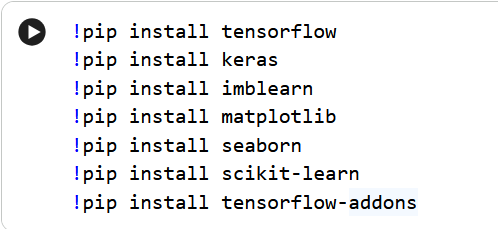

# Code Explain
This cell installs several Python libraries that are essential for the notebook's functionality. Specifically, it installs tensorflow, keras, imblearn, matplotlib, seaborn, scikit-learn, and tensorflow-addons. These libraries are commonly used for machine learning tasks, data visualization, and handling imbalanced datasets.

# Code
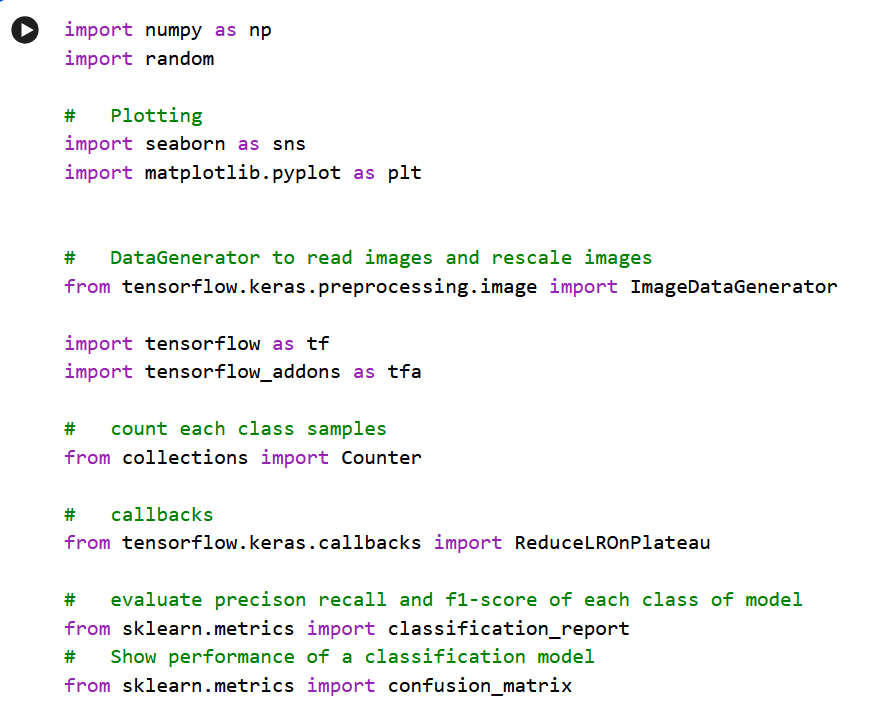
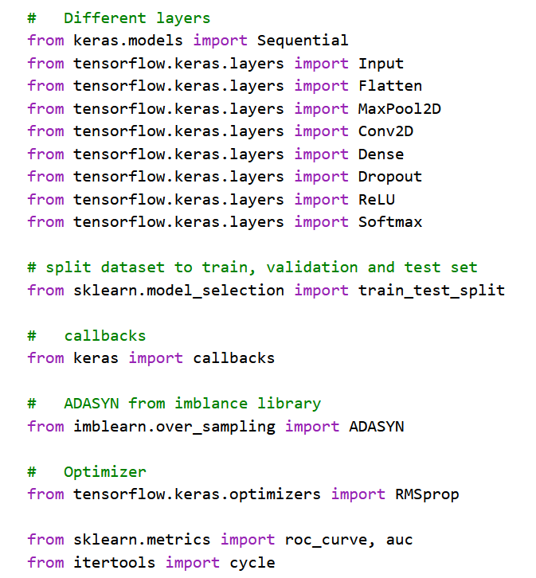

# Code Explain
This code cell is responsible for importing all the necessary Python libraries for this machine learning project. These imports include: numpy for numerical operations, random for generating random numbers, seaborn and matplotlib.pyplot for data visualization, ImageDataGenerator from TensorFlow Keras for image preprocessing, tensorflow and tensorflow_addons for building and training deep learning models, collections.Counter for counting items, ReduceLROnPlateau as a Keras callback, various modules from sklearn.metrics for model evaluation (like classification_report, confusion_matrix, roc_curve, auc), Sequential and different layers from Keras for defining the neural network architecture, train_test_split from scikit-learn for splitting data, ADASYN from imblearn for handling imbalanced datasets, RMSprop as an optimizer, and itertools.cycle for utility.

# Code
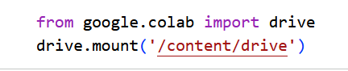

# Code Explain
The selected code imports the drive module from google.colab and then uses drive.mount('/content/drive') to mount your Google Drive to the /content/drive directory within the Colab environment. This allows the notebook to access files stored in your Google Drive.

# Code
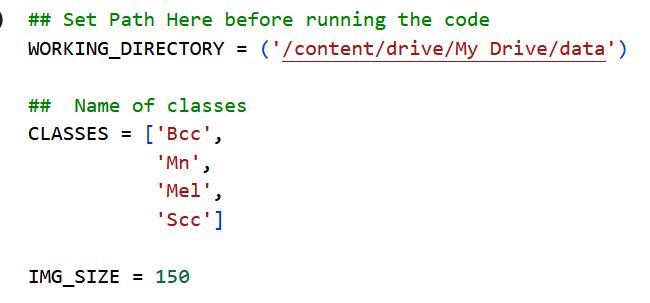

# Code Explain
This code snippet defines some global variables that will be used throughout the notebook. WORKING_DIRECTORY specifies the path to your dataset in Google Drive. CLASSES is a list containing the names of the four skin lesion classes: 'Bcc', 'Mn', 'Mel', and 'Scc'. IMG_SIZE sets the target size for the images, which is 150x150 pixels.
# Code
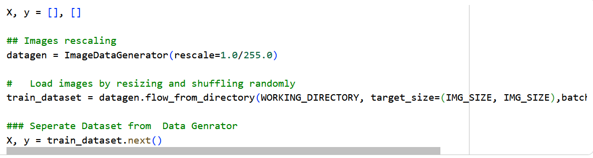

# Code Explain
This code initializes empty lists for X (to store images) and y (to store labels). It then creates an ImageDataGenerator instance that will rescale image pixel values from the 0-255 range to 0.0-1.0. Next, it uses datagen.flow_from_directory to load images from the WORKING_DIRECTORY, resizing them to IMG_SIZE (which is 150x150 pixels), setting a large batch_size to load all images at once, and shuffling them. Finally, it retrieves all the loaded images and their corresponding labels using train_dataset.next() and assigns them to X and y respectively.
# Code
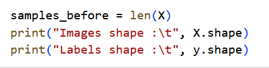

# Code Explain
This code snippet first stores the total number of image samples into a variable named samples_before. Then, it prints the dimensions (shape) of your image data (X) and your label data (y). This is useful for understanding the size and structure of your dataset at this stage.

# Code
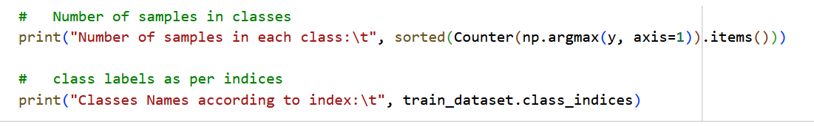

# Code Explain
This code snippet first uses Counter to count the number of samples belonging to each class. It does this by converting the one-hot encoded labels (y) back to single class indices using np.argmax(y, axis=1) and then sorting the counts. Secondly, it prints the dictionary train_dataset.class_indices, which shows the mapping between the class names (like 'Bcc', 'Mel') and their corresponding numerical indices.

# Code
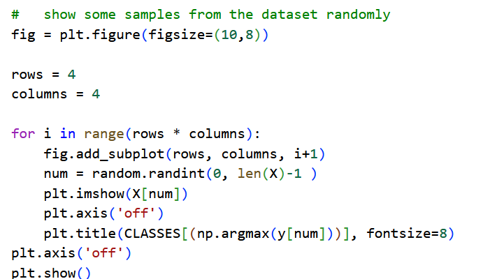

# Code Explain
This code generates and displays a grid of 16 random images from your dataset. It iterates 16 times, and in each iteration, it selects a random image from X and its corresponding label from y. It then uses plt.imshow to show the image, plt.axis('off') to remove the axis ticks, and plt.title to display the class name of the image based on the CLASSES list. Finally, plt.show() renders the entire grid of images.

# Code
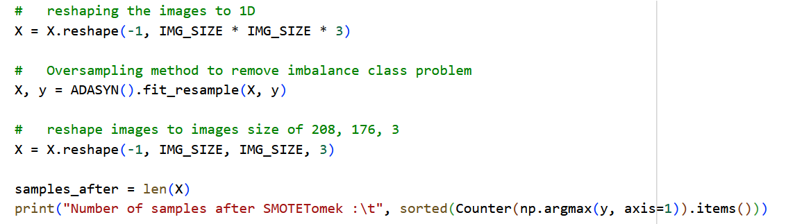

# Code Explain
This code cell first reshapes the images from their 3D format (IMG_SIZE, IMG_SIZE, 3) into a 1D vector. This 1D representation is necessary for the ADASYN algorithm. ADASYN (Adaptive Synthetic Sampling) is then applied to the X (images) and y (labels) data to address class imbalance by generating synthetic samples for minority classes. After oversampling, the images are reshaped back to their original 3D format (IMG_SIZE, IMG_SIZE, 3). Finally, it prints the number of samples in each class after the ADASYN process to show the effect of balancing.
# Code
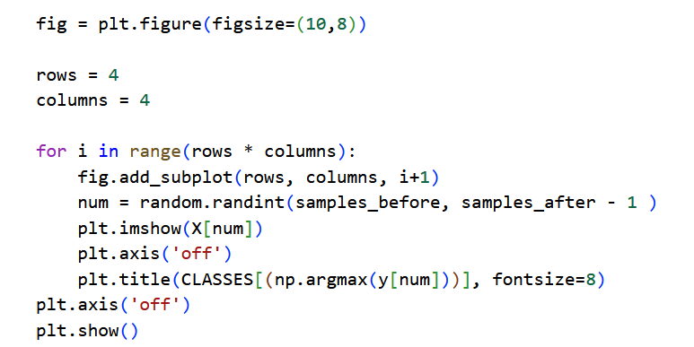

# Code Explain
This code is similar to a previous visualization, but its purpose is to show some of the image samples after the ADASYN oversampling has been applied. It creates a 4x4 grid, and for each spot, it picks a random image from the dataset starting from the original number of samples (samples_before) up to the new total number of samples (samples_after - 1). This is done to emphasize the newly generated or re-sampled images. It then displays the image and labels it with its corresponding class name.

# Code
#   10% split to validation and 90% split to train set
X_train, x_val, y_train, y_val = train_test_split(X,y, test_size = 0.1)

#   10% split to test from 90% of train and 80% remains in train set
X_train, x_test, y_train, y_test = train_test_split(X_train,y_train, test_size = 0.1)

# Number of samples after train test split
print("Number of samples after splitting into Training, validation & test set\n")

print("Train     \t",sorted(Counter(np.argmax(y_train, axis=1)).items()))
print("Validation\t",sorted(Counter(np.argmax(y_val, axis=1)).items()))
print("Test      \t",sorted(Counter(np.argmax(y_test, axis=1)).items()))

# Code Explain
This code cell is responsible for splitting your dataset into three distinct sets: training, validation, and testing. Initially, it splits the data into 90% for training and 10% for validation. Then, it takes the 90% training data and further splits it, reserving 10% of that for testing, leaving 80% of the original data for the final training set. Finally, it prints the number of samples for each class within the training, validation, and test sets to show how balanced the data remains after the split.

# Code
#   to free memeory we don't need this one as we split our data
del X, y

# Code Explain
This code line del X, y is used to free up memory by deleting the X and y variables. Since the data has already been split into X_train, x_val, y_train, and y_val in the previous steps, the original X and y are no longer needed and can be removed to optimize memory usage, especially when dealing with large datasets.

# Code
from keras.initializers import LecunUniformV2
init = LecunUniformV2

model = Sequential()

model.add(Input(shape=(IMG_SIZE, IMG_SIZE, 3)))

model.add(Conv2D(8, 3, padding="same", kernel_initializer=init))
model.add(ReLU())
model.add(MaxPool2D(pool_size=(2,2)))

model.add(Conv2D(16, 3, padding="same", kernel_initializer=init))
model.add(ReLU())
model.add(MaxPool2D(pool_size=(2,2)))

model.add(Conv2D(32, 3, padding="same", kernel_initializer=init))
model.add(ReLU())
model.add(MaxPool2D(pool_size=(2,2)))

model.add(Conv2D(64, 3, padding="same", kernel_initializer=init))
model.add(ReLU())
model.add(MaxPool2D(pool_size=(2,2)))

model.add(Conv2D(128, 3, padding="same", kernel_initializer=init))
model.add(ReLU())
model.add(MaxPool2D(pool_size=(2,2)))

model.add(Dropout(0.2))

model.add(Flatten())

model.add(Dense(512, kernel_initializer=init))
model.add(ReLU())

model.add(Dense(4, kernel_initializer=init))
model.add(Softmax())

model.summary()

# Code Explain
Certainly! This code defines a Convolutional Neural Network (CNN) model using Keras for image classification. Let me break down what each part does:

    from keras.initializers import LecunUniformV2 and init = LecunUniformV2: This imports and sets the LecunUniformV2 initializer, which is used to initialize the weights of the neural network layers.

    model = Sequential(): This creates a sequential model, which is a linear stack of layers.

    model.add(Input(shape=(IMG_SIZE, IMG_SIZE, 3))): This adds an input layer to the model. IMG_SIZE (which is 150 as defined earlier) means the input images are 150x150 pixels, and 3 indicates three color channels (RGB).

    Convolutional Blocks (e.g., model.add(Conv2D(8, 3, padding="same", kernel_initializer=init)), model.add(ReLU()), model.add(MaxPool2D(pool_size=(2,2)))): The model consists of five such blocks. Each block typically includes:
        Conv2D: A 2D convolutional layer that applies filters to the input image to extract features. The numbers (8, 16, 32, 64, 128) represent the number of filters, and 3 is the kernel size (3x3). padding="same" ensures the output feature map has the same dimensions as the input, and kernel_initializer=init uses the previously defined weight initializer.
        ReLU(): A Rectified Linear Unit activation function, which introduces non-linearity to the model, allowing it to learn complex patterns.
        MaxPool2D: A 2D max pooling layer that reduces the spatial dimensions (width and height) of the feature maps, helping to reduce computational cost and control overfitting. pool_size=(2,2) means it takes the maximum value over a 2x2 window.

    model.add(Dropout(0.2)): This layer randomly sets a fraction (0.2 or 20%) of input units to 0 at each update during training, which helps prevent overfitting by making the model less reliant on specific neurons.

    model.add(Flatten()): This layer flattens the 3D output of the convolutional layers (height x width x channels) into a 1D vector, preparing it for input into the dense layers.

    model.add(Dense(512, kernel_initializer=init)) and model.add(ReLU()): This is a fully connected (dense) layer with 512 neurons, followed by a ReLU activation function. This layer learns higher-level representations from the flattened features.

    model.add(Dense(4, kernel_initializer=init)) and model.add(Softmax()): This is the output layer. It has 4 neurons, corresponding to the 4 classes (Bcc, Mn, Mel, Scc). The Softmax activation function converts the raw outputs into a probability distribution over the classes, so the sum of probabilities for all classes for a given input will be 1.

    model.summary(): This prints a summary of the model architecture, including the type of each layer, its output shape, and the number of parameters (weights and biases) it contains. This is useful for understanding the model's complexity and structure.

# Code
### Model Compilation
model.compile(
    optimizer = RMSprop(learning_rate=0.0001),
    loss = tf.keras.losses.CategoricalCrossentropy(name='loss'),
    metrics=[
        tf.keras.metrics.CategoricalAccuracy(name='acc'),
        tf.keras.metrics.AUC(name='auc'),
        tfa.metrics.F1Score(num_classes=4),
        tf.metrics.Precision(name="precision"),
        tf.metrics.Recall(name="recall") ])

# Code Explain
 understanding of how well your model is expected to perform on new, unseen data.

# Code
# callbacks used in model to perform well
rop_callback = ReduceLROnPlateau(monitor="val_loss", patience=2)

CALLBACKS = [rop_callback]

# Code Explain

# Code
#   declare to run on small gpu create batch sizes of images
valAug = ImageDataGenerator()

#   defining batch size
batch_size = 32

history = model.fit(valAug.flow(X_train, y_train, batch_size=batch_size, shuffle = True),
steps_per_epoch=len(X_train) // batch_size,
validation_data=valAug.flow(x_val, y_val, batch_size=batch_size, shuffle = True),
validation_steps=len(x_test) // batch_size,
epochs= 30,
batch_size=batch_size,
callbacks = CALLBACKS
)

# Code Explain

# Code
### Evaluate Model
test_scores = model.evaluate(x_test, y_test, batch_size = 32)

print("\n\nTesting Loss : \t\t {0:0.6f}".format(test_scores[0] ))
print("Testing Accuracy : \t {0:0.6f} %".format(test_scores[1] * 100))
print("Testing AC : \t\t {0:0.6f} %".format(test_scores[2] * 100))
print("Testing F1-Score : \t {0:0.6f} %".format(
    ((test_scores[3][0] + test_scores[3][1] + test_scores[3][2] + test_scores[3][3])/4) * 100))
print("Testing Precision : \t {0:0.6f} %".format(test_scores[4] * 100))
print("Testing Recall : \t {0:0.6f} %".format(test_scores[5] * 100))

# Code Explain

# Code
plt.plot(history.history['acc'], 'b')
plt.plot(history.history['val_acc'], 'g')
plt.title("Model Accuracy")
plt.xlabel("Epochs")
plt.ylabel("Accuracy")
plt.legend(["train", "val"])
plt.show()

# Code Explain

# Code
pred_labels = model.predict(x_test, batch_size=32)

def roundoff(arr):
    arr[np.argwhere(arr != arr.max())] = 0
    arr[np.argwhere(arr == arr.max())] = 1
    return arr

for labels in pred_labels:
    labels = roundoff(labels)

print(classification_report(y_test, pred_labels, target_names=CLASSES))

# Code Explain

# Code
pred_ls = np.argmax(pred_labels, axis=1)
test_ls = np.argmax(y_test, axis=1)

conf_arr = confusion_matrix(test_ls, pred_ls)

plt.figure(figsize=(10, 8), dpi=80, facecolor='w', edgecolor='k')

ax = sns.heatmap(conf_arr, cmap='Greens', annot=True, fmt='d', xticklabels= CLASSES, yticklabels=CLASSES)

plt.title('Confusion Matrix of Model', fontweight='bold', fontsize=14.0)
plt.xlabel('Predictions', fontweight='bold', fontsize=13)
plt.ylabel('Ground Truth', fontweight='bold', fontsize=13)
plt.tight_layout()
plt.show(ax)

# Code Explain

# Code
fpr = dict()
tpr = dict()
roc_auc = dict()
for i in range(4):
    fpr[i], tpr[i], _ = roc_curve(y_test[:, i], pred_labels[:, i])
    roc_auc[i] = auc(fpr[i], tpr[i])

# Compute micro-average ROC curve and ROC area
fpr["micro"], tpr["micro"], _ = roc_curve(y_test.ravel(), pred_labels.ravel())
roc_auc["micro"] = auc(fpr["micro"], tpr["micro"])

plt.figure()
lw = 2
plt.plot(
    fpr[2],
    tpr[2],
    color="darkorange",
    lw=lw,
    label="ROC curve (area = %0.4f)" % roc_auc[2])

plt.plot([0, 1], [0, 1], color="navy", lw=lw, linestyle="--")
plt.xlabel("False Positive Rate")
plt.ylabel("True Positive Rate")
plt.title("Receiver operating characteristic ")
plt.legend(loc="lower right")
plt.show()

# Code Explain

# Code
n_classes = 4
# First aggregate all false positive rates
all_fpr = np.unique(np.concatenate([fpr[i] for i in range(n_classes)]))

# Then interpolate all ROC curves at this points
mean_tpr = np.zeros_like(all_fpr)
for i in range(n_classes):
    mean_tpr += np.interp(all_fpr, fpr[i], tpr[i])

# Finally average it and compute AUC
mean_tpr /= n_classes

fpr["macro"] = all_fpr
tpr["macro"] = mean_tpr
roc_auc["macro"] = auc(fpr["macro"], tpr["macro"])

# Plot all ROC curves
plt.figure()
plt.plot(
    fpr["micro"],
    tpr["micro"],
    label="micro-average ROC curve (area = {0:0.4f})".format(roc_auc["micro"]),
    color="deeppink",
    linestyle=":",
    linewidth=4,
)

plt.plot(
    fpr["macro"],
    tpr["macro"],
    label="macro-average ROC curve (area = {0:0.4f})".format(roc_auc["macro"]),
    color="navy",
    linestyle=":",
    linewidth=4,
)

for i in range(n_classes):
    plt.plot(
        fpr[i],
        tpr[i],
        lw=lw,
        label="ROC curve of class {0} (area = {1:0.4f})".format(i, roc_auc[i]),
    )

plt.plot([0, 1], [0, 1], "k--", lw=lw)
plt.xlabel("False Positive Rate")
plt.ylabel("True Positive Rate")
plt.title("Some extension of Receiver operating characteristic to multiclass")
plt.legend(loc="lower right")
plt.show()

# Code Explain

# @title
#    To save the model in the current directory
model.save(".\\model.h5")
This cell is used to evaluate the model's performance using Receiver Operating Characteristic (ROC) curves and their Area Under the Curve (AUC), which are common metrics for classification models. Here's a breakdown:

    Individual Class ROC/AUC: It iterates through each of the four classes (range(4)).
        roc_curve(y_test[:, i], pred_labels[:, i]): For each class i, this function calculates the False Positive Rate (FPR) and True Positive Rate (TPR) by comparing the true binary labels (y_test[:, i]) with the predicted probabilities (pred_labels[:, i]).
        auc(fpr[i], tpr[i]): This then computes the Area Under the Curve for that specific class, summarizing its diagnostic ability.

    Micro-average ROC/AUC: roc_curve(y_test.ravel(), pred_labels.ravel()) and auc(fpr["micro"], tpr["micro"]) calculate the micro-average ROC curve and AUC. This is done by flattening all the true labels and predicted probabilities across all classes and then computing the ROC curve globally. It gives a good indication of the overall performance without distinguishing between classes.

    Plotting: The code then specifically plots the ROC curve for class 2, using fpr[2] and tpr[2]. The lw=lw (line width) and label (including the AUC value) are set for visualization. A diagonal dashed line ([0, 1] [0, 1]) is also plotted as a reference, representing a random classifier. The plot visually represents the trade-off between the true positive rate and the false positive rate for different classification thresholds for class 2. A higher and more curved line towards the top-left corner indicates better performance. The AUC value provides a single number summary of this performance, with 1 being perfect and 0.5 being random.

